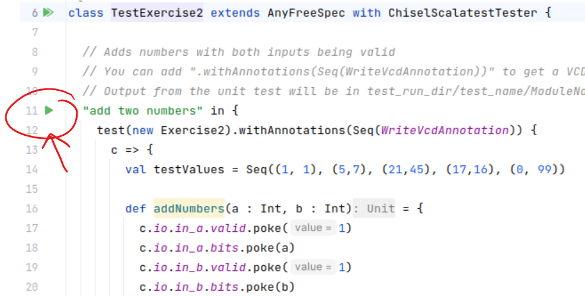

Chisel Exercises
================

## Overview

This repository contains a series of exercises for learning Chisel.  Each exercise introduces new concepts in
the language.

These exercises describe some parts of the Chisel language, but are not intended to be a manual or stand-alone
reference to the language.  Users should refer to [Digital Design with Chisel](https://www.imm.dtu.dk/~masca/chisel-book.pdf)
for a more comprehensive reference.

The [Chisel Cookbook](https://www.chisel-lang.org/chisel3/docs/cookbooks/cookbook.html) has references on specific 
cases and their answers.

### System Prerequisites

The exercises are designed such that the only prerequisite is sbt (and Java, which is required to run sbt).
The IntelliJ IDE is recommended but not required, and Gtkwave is also recommended to view generated waveforms.

## Exercises

Each exercise consists of a Chisel template block called "Exercise#", which defines the port interface for the 
exercise code, and a markup file which contains background information and introduces the specific language elements
that this exercise is covering.

The hardware problem specification for each exercise is written in the comment block of the Chisel code.

### Debugging Your Code

Each exercise has a corresponding unit test, which you will run to determine if you have correctly completed the
exercise.  The unit tests are located in the file src/test/exercise#/TestExercise#.scala, where '#' is the number
of the exercise.

The unit tests follow the structure common for Scala unit tests, which is a class which contains one or more tests.
Each test is identified by a string which briefly describes the purpose of the test.

You can run the tests for your exercise by navigating to the test in the explorer and clicking the
"play" icon: 


If you are running in the sbt shell, you can use the "testOnly" command in the shell to run a specific test:

```
> testOnly exercise1/TestExercise1
[info] TestExercise1:
[info] - add two numbers
[info] Run completed in 772 milliseconds.
[info] Total number of tests run: 1
[info] Suites: completed 1, aborted 0
[info] Tests: succeeded 1, failed 0, canceled 0, ignored 0, pending 0
[info] All tests passed.
[success] Total time: 1 s, completed May 16, 2023, 12:52:31 PM
[IJ]
```

### Viewing Waveforms

After running a unit test, any output products will be put in test_run_dir/test_name. 
The test name is the descriptor string in the unit test.  For example, the Exercise 1
unit test from above is called "add two numbers", and the results will be put in
test_run_dir/add_two_numbers.

Any Chisel unit test can be configured to produce a VCD file by adding the "WriteVcdAnnotation"
to the test.  If this is added, you will see a .vcd file created in the directory.  The
VCD file is named after the Chisel module which was tested (in this case, "Exercise1.vcd").

### [Exercise 1](src/main/scala/exercise1/Exercise1.md)

The first exercise introduces basic language concepts such as inputs and outputs, Wire and Reg declarations,
and putting these together to form a working design.  It also has a simple introduction to unit testing.

### [Exercise 2](src/main/scala/exercise2/Exercise2.md)

The second exercise adds composite types and goes into more detail about different Chisel hardware types.

### [Exercise 3](src/main/scala/exercise3/Exercise3.md)

The third exercise adds branching and control statements, and state machine coding.

### [Exercise 4](src/main/scala/exercise4/Exercise4.md)

The fourth exercise shows how to instantiate and connect to child modules, and perform more complex design
work.

### [Exercise 5](src/main/scala/exercise5/Exercise5.md)

The fifth exercise explores Chisel type conversions and parameterized design.

### [Exercise 6](src/main/scala/exercise5/Exercise6.md)

Exercise 6 uses some Chisel library components and introduces Scala generic classes.
